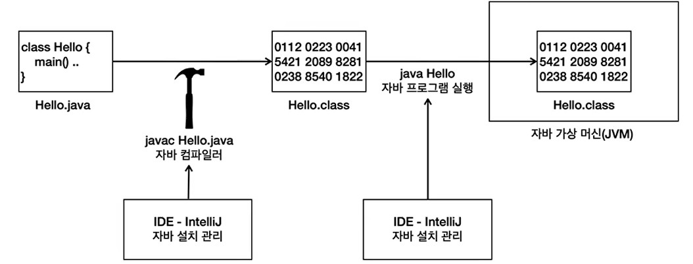

>`Jekyll`를 활용한 `GitHub`블로그 포스트에서
>
>로컬 이미지를 삽입하는 방법.

<br>

<br>

## 상대경로로 이미지를 삽입하는 경우

``` markdown

```


### ‼️ Error ‼️
``` bash
[2024-11-19 17:39:10] ERROR `/programming/2024/11/19/assets/img/programming/java/java-intellij-compile-exe-image.png' not found.
```
경로를 찾을 수 없다고 에러 메세지가 뜨는데, 경로를 자세히 보면.. 내가 작성한 경로와 다르다.
앞에 ``/programming/2024/11/19/` 가 붙는데,

Jekyll이 생성한 포스트 URL 구조(/programming/2024/11/19/)가 경로 앞에 붙기 때문이다.

따라서 이미지를 로컬에서 삽입 할 떄에는 **절대경로**를 이용하는 것이 좋다.

<br>

<br>


## 절대경로를 사용한 이미지 삽입
``` markdown

```

절대 경로로 이미지 경로를 지정해 주면, Jekyll이 포스트 URL 구조와 관계 없이 사이트 루트에서부터
이미지를 찾을 수 있게 할 수 있다.